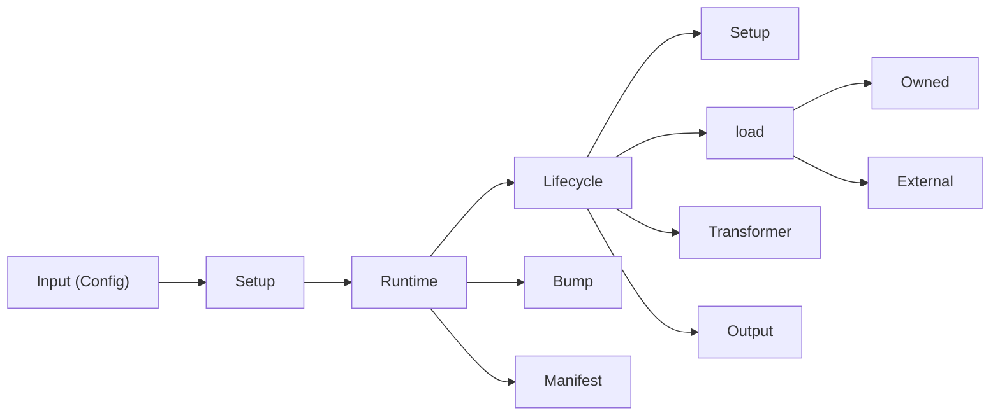

---
# try also 'default' to start simple
theme: default
# random image from a curated Unsplash collection by Anthony
# like them? see https://unsplash.com/collections/94734566/slidev
title: Intro

layout: main

class: bg-zinc-900 h-full text-center
# https://sli.dev/features/drawing
drawings:
  persist: false
# slide transition: https://sli.dev/guide/animations.html#slide-transitions
transition: slide-left
# enable MDC Syntax: https://sli.dev/features/mdc
mdc: true
# duration of the presentation
duration: 35min
---

  <h4 class="font-semibold">Introduction</h4>
  <h1 class="mt-2"><strong>0xNext</strong>: Building the Open-Source   Layer for Web3 Liquidity</h1>
  <button @click="$nav.nextSlide" class="btn-primary">next</button>

<!--
The last comment block of each slide will be treated as slide notes. It will be visible and editable in Presenter Mode along with the slide. [Read more in the docs](https://sli.dev/guide/syntax.html#notes)
-->

---

## transition: fade-out

# **0xList/core**

  

    <h3>1. Start-up</h3>
    
Loads, parses and validates the configuration from specified file ( defaults to 0xlist.config.* ).

  

  

    <h3>2. Setup</h3>
    
Verifies the integrity of the provided plugins and ensures that you have installed the bare minimum you need.

  

  

    <h3>3. Runtime</h3>
    
Runs the lifecycle of plugins

  

